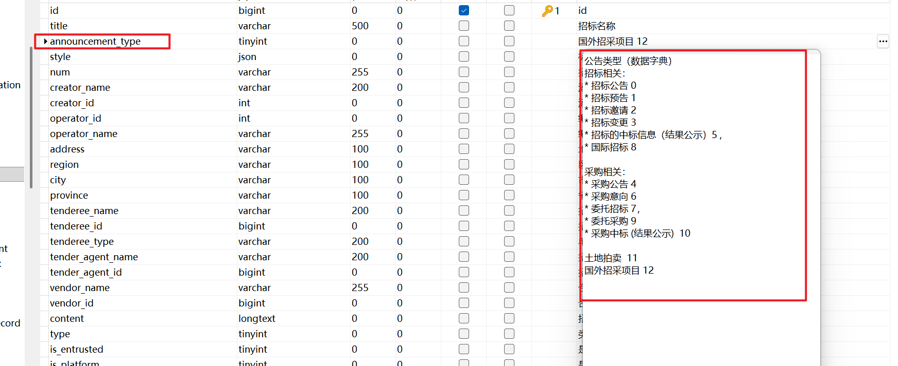
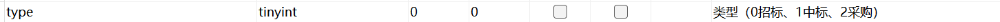

标题——title
（标题）链接——from_site
发布时间——release_time
省份——province
正文——content
announcement_type——announcement_type（指每个大类下的信息类型分类，具体id如图）
type——type（指招标信息0、中标信息1、采购2三大类）
创建时间——create_time
修改时间——update_time

公网 IP：49.233.77.57
用户名：ubuntu
密码：Ubuntumima?